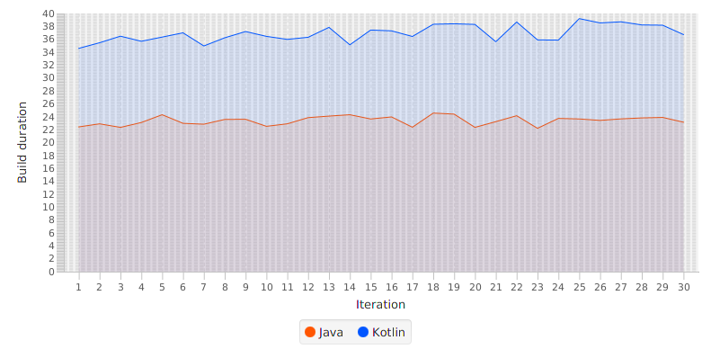

# Fake Social Project
Fake Social Project is part of my UNI thesis about comparing Android development with Java versus Android development with Kotlin.

### Modules
Project is separated into multiple modules.
- Java Fake Social ([HERE](https://github.com/SlickBot/JavaFakeSocial/))
- Kotlin Fake Social ([HERE](https://github.com/SlickBot/KotlinFakeSocial/))
- Anko Fake Social ([HERE](https://github.com/SlickBot/AnkoFakeSocial/))

GitCompare is used to compare languages used on Github.
- GitCompare ([HERE](https://github.com/SlickBot/GitCompare/))

BuildCompare is used to compare build durations.
- BuildCompare (this)

AppiumCompare is used to compare applications.
- AppiumCompare ([HERE](https://github.com/SlickBot/AppiumCompare/))

## BuildCompare

This is a program, which using ADB builds projects and displays graph of build durations.

### Screenshot

### Dependencies
- [Kotlin](https://github.com/JetBrains/kotlin)
*1.3.31*
- [TornadoFX](https://github.com/edvin/tornadofx)
*1.7.17*